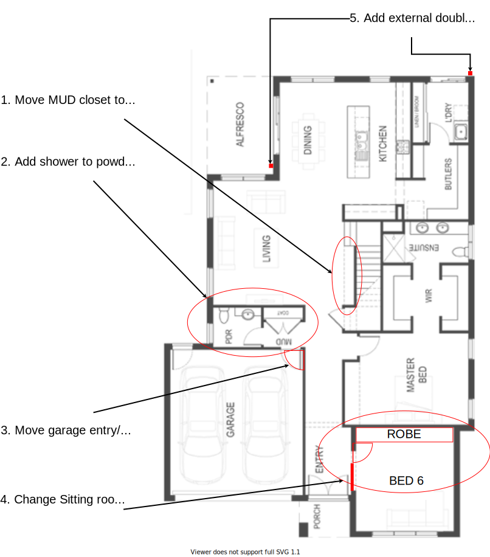
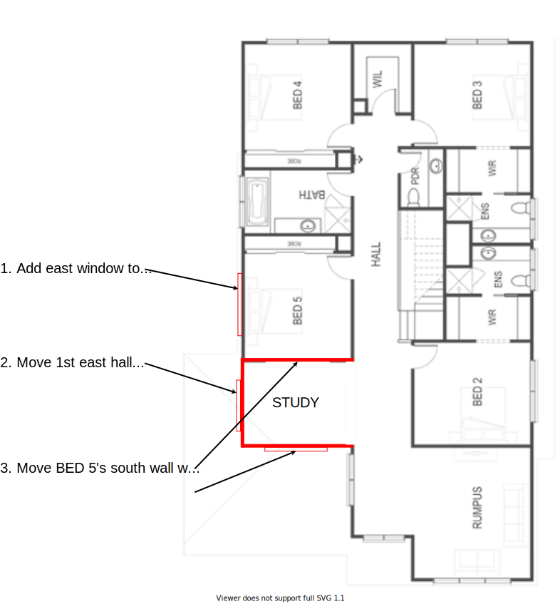

# Miller on Camellia Ct

Hi Lorraine,

In this repository you will find my notes with regards to getting the Miller home our property as per our requirements. Even a knock-down rebuild of my current home which was built in the 70's would require report and consent to be approved via council due to nature of the odd shaped block.

---
## Build envelope

The build envelope represents the acceptable build region by the Monash council. This region is illustrated as the central area in the figure below.

Figure 1: Build envelope with front, read & side setbacks 

---
## Miller Ground Floor Sitting

To be more consistent in line with other houses in the court a slight preference as been given to reducing the front violation over the rear violation. 

This sitting of the Miller design on this property tries to achieve the most likely approvable position with regards to rear & front setbacks.

Figure 2: Miller stting 

The regions marked in orange are violations (ie. the areas of concern that encrouch the setbacks). These violations should however be considered in context of the setback areas.

|Setback|Total Surface Area|Violation Area|
|:---:|:---:|:---:|
|Front (ie. south)|214m2|**8m2**|
|Rear (ie. north)|69m2|**9m2**|

---
## Miller Ground Floor Changes

The following are the preferred changes to the ground level:

1. Move MUD closet to beside the staircase
2. Add shower to powder room. Independent toilet & small basin is preferred
3. Move garage entry/exit to east wall
4. Change Sitting room into BED 6 by adding ROBE & Door. Keep same window! 

Note, BED 6 may get transformed back into Sitting room if we ever decide to sell.

|Original|Changes|
|:---:|:---:|
|||

Figure 3: Ground level changes 

---

## Miller Upper Floor Changes

The following are the preferred changes to the upper level:

1. Add east window to BED 5
2. Move 1st east hall window to study
3. Move BED 5's south wall with window to be Study south wall w/ window & add standard wall to Bed 5 

|Original|Changes|
|:---:|:---:|
|||

Figure 4: Upper level changes 

Move BED 5's south wall with window to be Study south wall w/ window & add standard wall to Bed 5 as south wall. 